# Data Visualization Portal
[Link to Data Visualization Portal](https://visualization.genelab.nasa.gov/data/)
## About GeneLab
GeneLab is an open-access resource that enables scientists to upload, store, share, and analyze omics data from spaceflight experiments. It facilitates information sharing, fosters innovation, and accelerates scientific discovery in space biology. By studying the effects of microgravity and space environment on DNA, RNA, proteins, and metabolites, GeneLab contributes to our understanding of biology, and advances in genomics. It provides coordinated data sets and metadata, allowing users to gain comprehensive insights and make novel discoveries. GeneLab's impact lies in its ability to facilitate information sharing, drive innovation, and ultimately expand our knowledge of how space conditions affect the fundamental building blocks of life.
## About Data Visualization
GeneLab has a Data Visualiation portal that provides users have the ability to interact with the processed data from space related studies within GeneLab's database. The portal encompasses various visualization types, including Gene Expression query tables, Dendrograms, Heatmaps, Ideogram, Gene Set Enrichment Analysis and a range of interactive plots including PCA plots, Pair plots, and Volcano plots. Each tool offers researchers flexibility to adjust parameters and explore specific aspects of the data effectively.

## Metadata Dashboard
[Link to Metadata Dashboard](https://visualization.genelab.nasa.gov/data/)

The metadata dashboard is designed to help users narrow search results for experimental data. It provides various tools for filtering and displaying results.
The main tools for filtering the studies table's results are the Pi charts and the filters on the left side of the dashboard. Each section of the Pi chart acts as a separate section of filters, and when a filter from the Pi chart is selected the results containing that factor will automatically populate in the studies table below. A user can make one selection on each Pi chart to narrow results in the studies table further.

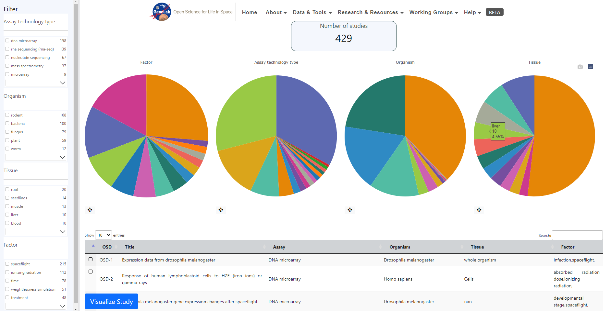

In addition to the Pi Charts, there are specific filters on the left side of the dashboard that can be selected to narrow down results. When selecting filters on the Pi charts or on the left side of the dashboard, both sections will be updated to show the selected filters and the studies table will be updated to show the relevant studies.

Another tool that is provided with each individual Pi chart is the crosshair located on the bottom-left of the chart. When you select the crosshair a bar graph displaying the different factors listed within the Pi chart will appear. 

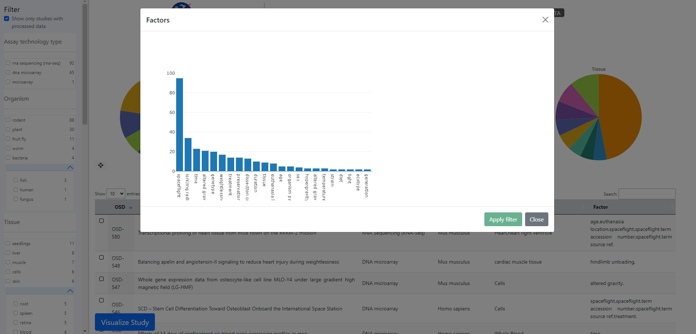

The bar graph is an additional way to display the number of results each factor has, and when a factor is selected from the bar graph that individual factor will be broken down further into the various types of the factor that was selected. The below example shows the breakdown of choosing "Time" from the bar graph selection.

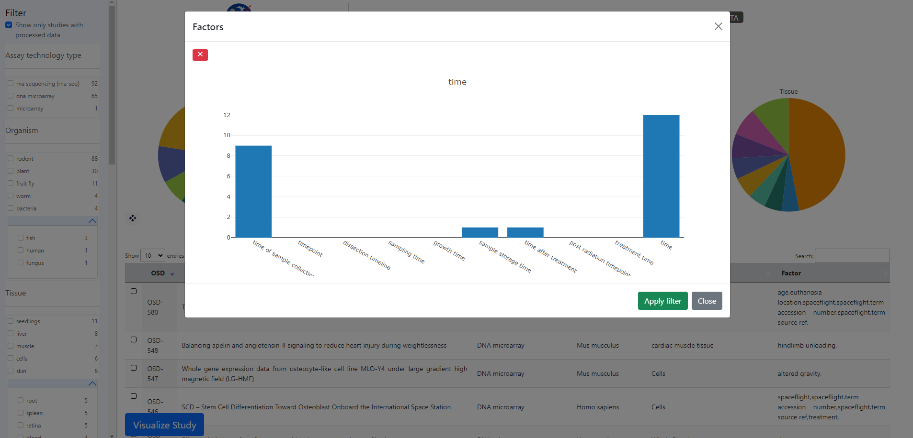

*Krona section*

After selecting the desired filter from the bar graph, the user can press the “apply filter” button to update the results within the studies table. When a filter is selected, a red "X" will also appear next to the crosshair of the associated Pi chart. Pressing the red "X" button will clear the selected filters.

## Studies Table

Below the Pi charts is a table that lists the studies resulting from the selected filters from above. The table includes the following information for each study: OSD, Title, Assay, Organism, Tissue, and Factor.

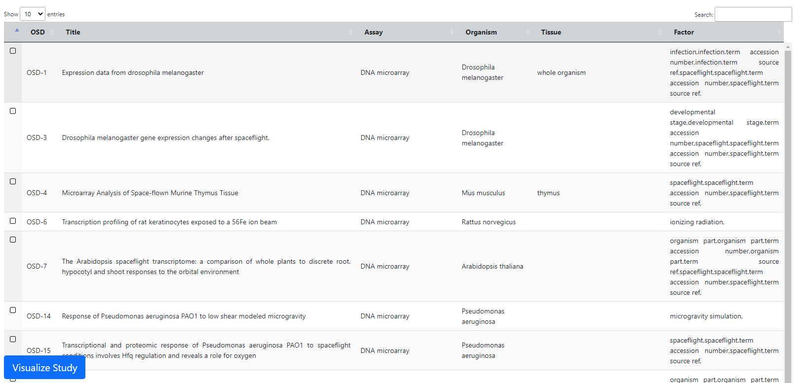

By default the studies will be listed in order of OSD-# from smallest to largest, but the order can be flipped based on each information category by clicking the title of the category twice.

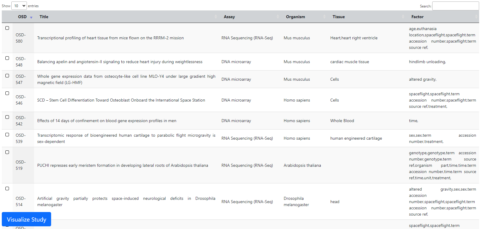

Finally, once a user has selected a study or multiple studies they can press the "Visualize Study" button to be directed to the data visualization tools. A user may also select multiple studies to visualize simultaneously in which case a user will be directed to a Multi-Study preview page before being directed to the data visualization tools.

## Sidebar Functions

When a user has selected the study/studies to visualize, they will be drirected to the data visualization tools, where a sidebar of helpful tools is provided on the left side of the screen.

The "Study Details" button is located at the top of the sidebar. This button pulls up a display with the study information including a small description. The display also includes a tab labeled “samples” that a user can press to see the individual samples and additional information for the study.

Below the study details button is a label for each individual plot provided for a user within the data visualization tool. Clicking these labels will automatically direct the user to the plot associated with the label.

At the bottom of the sidebar is the default Group selection that is utilized for each plot. A user can modify the groups that are selected by pressing the "Modify Groups" button. This button will prompt the user to select the individual groups that a user would like to see displayed on each plot.

A feature exclusive to multi-study visualization is the option to download the combined Differential Gene Expression table.

DGE stands for Differential Gene Expression and represents the number of sequence reads that originated from a particular gene. The higher the number of counts, the more reads associated with that gene, and the assumption that there was a higher level of expression of that gene in the sample.

When a user accesses the multi-study visualization the DGE table will have several options to export the information at the top of the table. These options include [export options]

## Plotly

Plotly is a third party software that is using data provided by GeneLab to create the interactive visualizations displayed. At the top-right corner of each plot will be options to help a user better visualize the data.

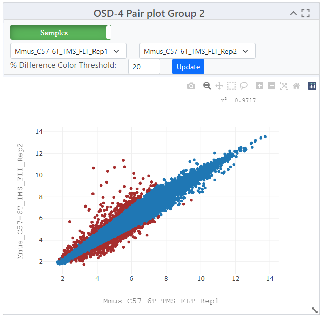

The house logo within the options will reset the axes of the plots back to default. Users are also provided the option to zoom in/out on each plot as well as autoscale the graphic. There are two tools provided for data point selection, which are the lasso tool and box tool. Each of these tools provides a shape that will select any data points that fall within them. Lastly, there is a download button in the shape of a camera that will let you download the plot as a PNG file. 

## PCA Plots
[Link to read about PCA plots](https://builtin.com/data-science/step-step-explanation-principal-component-analysis)

PCA stands for Principal Component Analysis, and this type of plot is used to reduce the dimensionality of large sets of data to simplify the process of analyzing the data points.

Each PCA plot will include options for a 2D and 3D representation of the data. The default selection is a 3D representation on an "X", "Y", and "Z" axis.

In the upper left corner of the plot area select the "2D" button and then press "Update"

The graph will update to display the data on an "X", and "Y" axis only.

The "Color by Factor" feature allows users to select a specific factor from the study for representation on the graph to allow for an easier comparison between differences in the data.

Select the "Color by Facor" drop down menu

Within the drop down menu select one factor, then press the "Update" button

In this example, the "Cell Line" factor was selected from the drop down

The results will now be represented by colors matching the factor that was selected.

In this example, (OSD-154) the colors are representing the different cell lines from the experiment and clearly shows how the cell lines could be a factor in the differences between the data points.

Another feature within the PCA plot tool allows users to hide factors by selecting the label located on the right side of the plot.

The two labels provided are the cell lines "GM15036" which is represented by the color blue, and "GM15510" represented by the color orange.

Click on the label "GM15036" and the data points will be hidden as shown below

Click on the label "GM15036" a second time and the data will return.

## Pair Plots
[Link to read about Pair Plots](https://medium.com/analytics-vidhya/pairplot-visualization-16325cd725e6#:~:text=Pair%20plot%20is%20used%20to,separation%20in%20our%20data%2Dset.)

Pair plots are used for Exploratory Data Analysis, where the plot visualizes the data in order to find a relationsip between variables that can be continuous or categorical. A Pair plot is used to understand the best set of features to explain a relationship between two variables or to form the most separated clusters. It also helps to form some simple classification models by drawing some simple lines or make linear separation in a dataset.

The default display for the pair plot will be the comparison between two sets of data with a % difference color threshold of 20%. Two plots will be displayed on the dashboard for the ability to compare multiple sets of data simultaneously. 

Within the plot, users have the ability to change the % difference color threshold. Below is an example of the color threshold being altered to 37%.

Clicking each of the drop down menus will allow user to change which axis the sample data is displayed on.

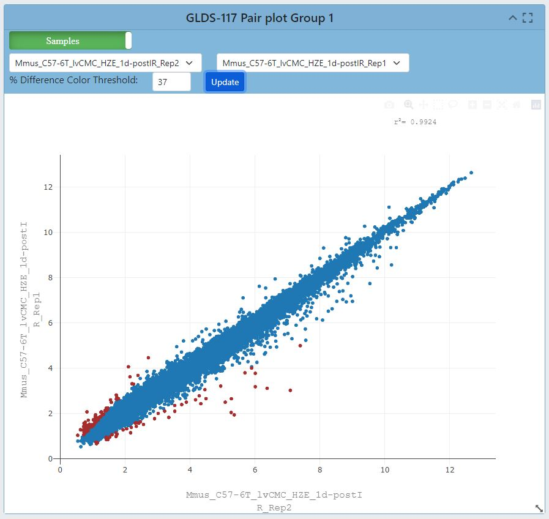

Users also have the capability to view different data correlations by clicking the green "Samples" button at the top of the plot. Clicking this button will change the dropdown to show multiple correlation coefficients for a set of data. In the example below the data has three correlation coefficients that can be chosen.

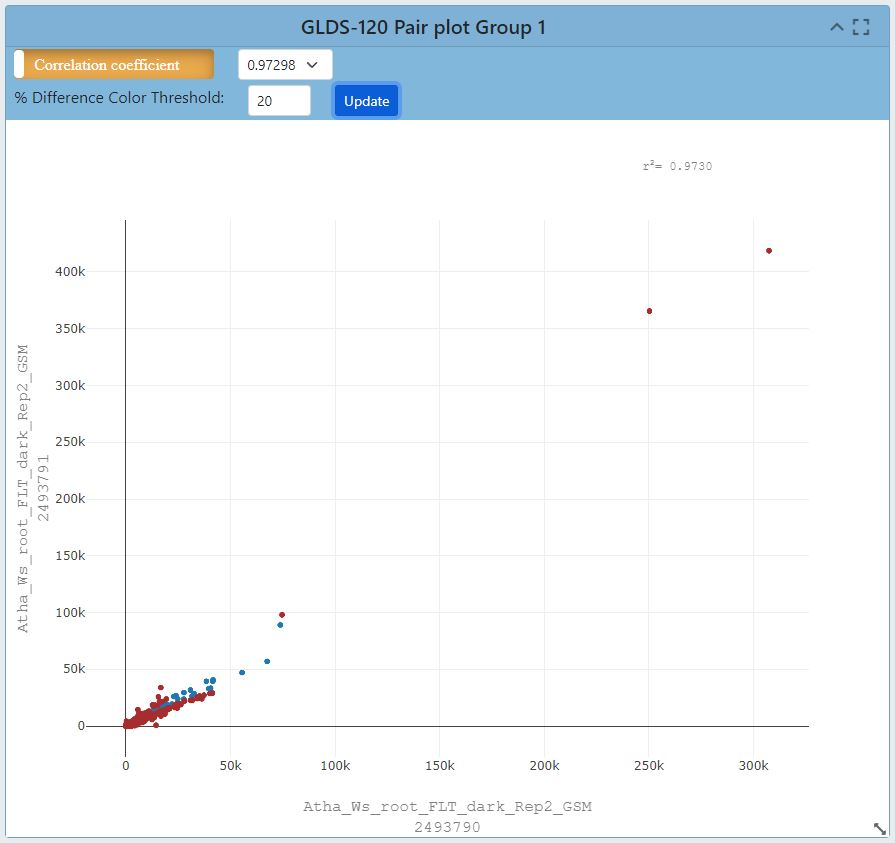

## Volcano Plots
[Link to read about Volcanoi Plots](https://www.htgmolecular.com/blog/2022-08-25/understanding-volcano-plots)

A volcano plot is useful for identifying events that differ significantly between two groups of experimental subjects. The name volcano plot comes from its resemblance to a volcanic eruption with the most significant points at the top, like spewed pieces of molten lava. Each point on the graph represents a gene. The log2-fold differences between the groups are plotted on the x-axis and the -log10 p-value differences are plotted on the y-axis. The horizontal dashed line represents the significance threshold specified in the analysis, usually derived using a multiple testing correction.

The default display for Volcano Plots will have the -Log10(Adj P Value) with and Adj P Value threshold of 0.05 and a Log2 FC threshold of 1.00 as shown below.

Users have the ability to change the type of data displayed on the Y axis, and the options from the dropdown menu inculde "P Value, Adjusted P Value, and -Log10(P Value)". Below is an example of the "P value" display for a volcano plot.

The ability to change the P value threshold is available and the image below shows a P value threshold increase to 0.8. 

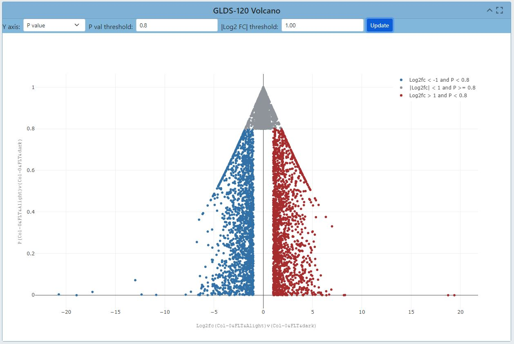

## Heatmap
[Link to read about Heatmaps](https://www.htgmolecular.com/blog/2023-05-03/understanding-heat-maps-in-gene-expression-profiling)

Heatmaps allow researchers to quickly and easily identify patterns of gene expression that are associated with specific conditions or treatments and uses color coding to indicate the magnitude of values. By measuring the number of RNA molecules produced by genes in a particular sample, researchers can determine the level of gene expression. The default settings for the heat map are shown in the image below. The heatmap links genes depending on how alike they are based on the conditions set in the experiment.  

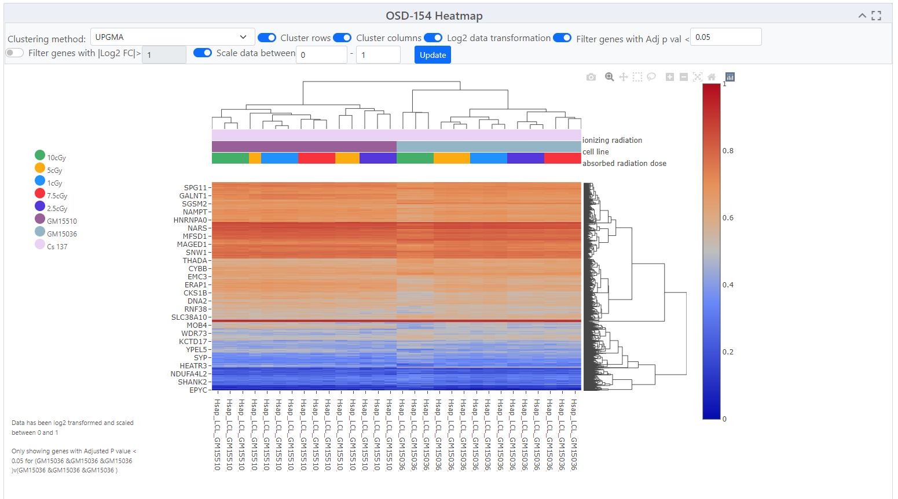

* Choosing Clustering Method:

  * Users can select a clustering method to display results. The default is often set to UPGMA (Unweighted Pair Group Method with Arithmetic Mean).
  * Clustering helps group genes with similar expression profiles, making patterns more apparent.

* Toggling Rows and Columns:

  * Users can toggle off rows or columns of genes. This affects how the heatmap links genes based on similarity.
  * Toggling off rows or columns can help focus on specific groups of genes and their expression patterns.
 
 *Toggle row/columns Picture*

* Log2 Transformation:

  * The Log2 transformation is available to enhance the display of genes with more pronounced differences.
  * Applying Log2 transformation can reveal subtler variations in gene expression between conditions.

* Filtering by Significance:

  * Users can filter the genes displayed on the heatmap based on their significance.
  * This filtering helps highlight genes with statistically significant expression changes.
 
Analyze the heatmap to identify gene expression patterns associated with specific conditions or treatments. Pay attention to color intensity and clustering.

## DGE Table

Each study will have an associated Differential Gene Expression (DGE) table available that includes information on each individual sample from the study.

To export a Differential Gene Expression (DGE) table from the study visualization page, follow these steps:

1. Locate the DGE Table: Scroll down to the bottom of the study visualization page. There, you'll find the Differential Gene Expression table containing valuable data.

2. Copy the Table to Clipboard:

* Identify the "Copy" button within the DGE table. It should be prominently displayed.
* Click the "Copy" button. This action will copy the entire table, including all data, headers, and values, to your device's clipboard.

3. Save as CSV, Excel, PDF, or Print:

* To save the data in various file formats, look for the corresponding buttons.
* For a CSV file:
  * Locate and click the "CSV" button. This will prompt a download of the DGE table data in CSV format to your device.
* For an Excel file:
  * Look for the "Excel" button. Click it to initiate the download of the DGE table data in Excel format (XLSX) to your device.
* For a PDF file:
  * Find and select the "PDF" button. This action will convert the DGE table into a PDF file that you can save to your device.
* For Printing:
  * Spot the "Print" button. Clicking this will open a new window displaying a printer-friendly version of the DGE table.
  * You can then use your browser's print functionality to print the table directly.

By following these steps, you can export the Differential Gene Expression table data from the study visualization page in a variety of formats. Choose the method that best suits your needs to access and analyze the DGE data efficiently.

## GSEA
[Link to read about GSEA](https://www.pnas.org/doi/10.1073/pnas.0506580102)

GSEA stands for gene set enrichment analysis, a method to identify gene groups that are overrepresented in a large gene set. It uses statistics to pinpoint significantly enriched or depleted gene classes.

*Overview Picture*

On the Gene Lab Visualization Portal, you'll find a dedicated GSEA section for each study. Within this GSEA section, there are various parameters you can customize:

1. Choose Gene Sets: Opt for the gene sets to filter from. The default is "KEGG 2019," which is recommended.
2. Permutations: Decide the number of permutations you desire and whether they're based on phenotypes or gene sets.
3. Gene Number Range: Adjust the minimum and maximum gene sizes. Increasing the minimum size omits genes with fewer than 15 data points, same for the maximum size.
4. Weighted Score Type: Defaults to one, representing the t-test. Alternatively, choose signal-to-noise, fold change, or log2 fold change.
5. Statistical Method: Select your preferred statistical method. The default is the t-test.

To update the plot with your changes, simply click "Update." A range of plot types is available:

  * NES Table: View different gene sets in a table format. Export this table using the options at the top.
  * NES Plot: The default plot displays normalized enrichment scores based on gene sets.
  * Dot Plot: Similar to NES Plot, it showcases the top six gene sets based on false discovery rate (FDR). FDR indicates the likelihood that a result is valid, e.g., FDR of 0.25 means a 25% chance of validity.
  * Enrichment Plot: This reveals the fold change distribution of the top three gene sets with an FDR of under 0.25.
  * Network Plot: Visualize relationships between gene sets using a network plot.
  * GSEA Info: For in-depth details about GSEA creation, statistics, and plot documentation.

With these steps, you can effectively navigate and utilize the GSEA section, gaining insights into gene set enrichment analysis for your study.

## Ideogram
[Link to read about Ideograms]([https://medium.com/analytics-vidhya/pairplot-visualization-16325cd725e6#:~:text=Pair%20plot%20is%20used%20to,separation%20in%20our%20data%2Dset.](https://github.com/eweitz/ideogram/tree/gh-pages))

Ideograms provide a schematic representation of chromosomes. They are used to show the relative size of the chromosomes and their characteristic banding patterns.

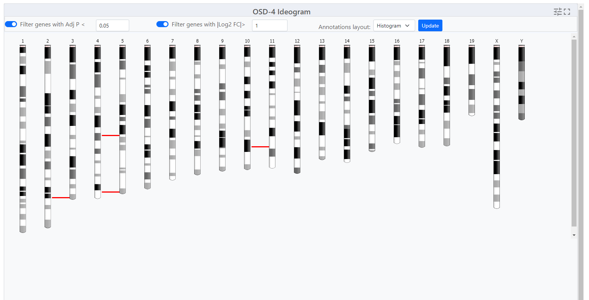

The ideogram available through GeneLab offers three options for customization. Two options are related to how the user would like to filter significant genes, the first choice being genes with an adjusted P value less than the value set in the text box, and the second choice would be filter by a Log2 FC value greater than the value set in the text box. The third options to customize the plot allows the user to change the layout of annotations for the Ideogram from a drop down menu.

## Multistudy Page Overview

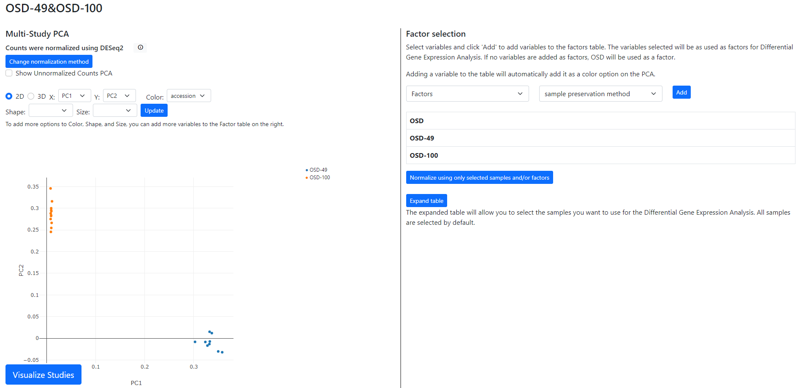

Multi-Study analysis is an advanced tool designed for analyzing and visualizing multiple RNA sequencing studies concurrently. The multi-study page is used to initialize the parameters for data visualization of the multiple studies. Researchers can uncover intricate patterns of gene expression associated with specific conditions or treatments across a variety of experiments. Below are detailed instructions on how to effectively navigate and utilize the Multi-Study Page:

* Selecting studies for Multi-study analysis:

  * For your initial test, let's use rodent studies as an example.
  * Start by selecting "rodent" as the organism of interest.
    * *Since combining DNA microarray assays is not supported, ensure to filter by both "rodent" and "RNA sequencing" in the assay technology type.*
  * Choose two different rodent studies that encompass various tissue types. For instance, select "OSD-49" and "OSD-100."
  * Mark the checkboxes beside the selected studies in the studies table.
  * Click the "Visualize Study" button to proceed.

* Data Normalization:

  * A dialog box will appear to prompt you for data normalization options.
  * The default selection is often "DSeq2" for normalization, but you can also choose "No Normalization."
  * If desired, you can enter your email address to receive a notification when the studies have been combined and normalized.
    * Alternatively, proceed without entering an email address.
      
* Exploring the Multi-Study Page:

  * A PCA chart for data visualization will be included on the multi-study page
    * Utilize the PCA chart options to tailor your visualization based on specific criteria.

* Factor Selection and Differential Gene Analysis:

  * Under "Factor Selection," choose variables to generate a factors table for differential gene analysis.
  * Select parameters, characteristics, or factors from the dropdown list to add to the table.

* Normalization and PCA Insights:

  * Understand normalization details by clicking the Information button next to the normalization method.
  * View the PCA chart, which provides insights into data distribution after normalization.

* Modifying Normalization Method:

  * If you wish to change the normalization method (e.g., from "DSeek2" to "No Normalization"), click "Change Normalization Method."
  * Enter your email address if desired, and choose the desired normalization approach.
    
* Sample Selection for Gene Expression Analysis:

  * Select specific samples by clicking the "Select labeled, expand table" button.
  * Choose samples based on factors added during factor selection.

* Visualizing and Downloading Results:

  * Click "Visualize Studies" to proceed to visualization plots or download the accounts table.
  * Depending on your selection, enter your email address for a notification upon completion.

* Exploring Visualization Plots:

  * Upon completion, the page will direct you to a range of visualization plots and graphs for your data analysis.

With these comprehensive instructions, you are well-equipped to navigate the Multi-Study Page efficiently. This tool empowers you to analyze multiple RNA sequencing studies simultaneously, uncovering complex gene expression patterns and gaining valuable insights into your experimental data.
