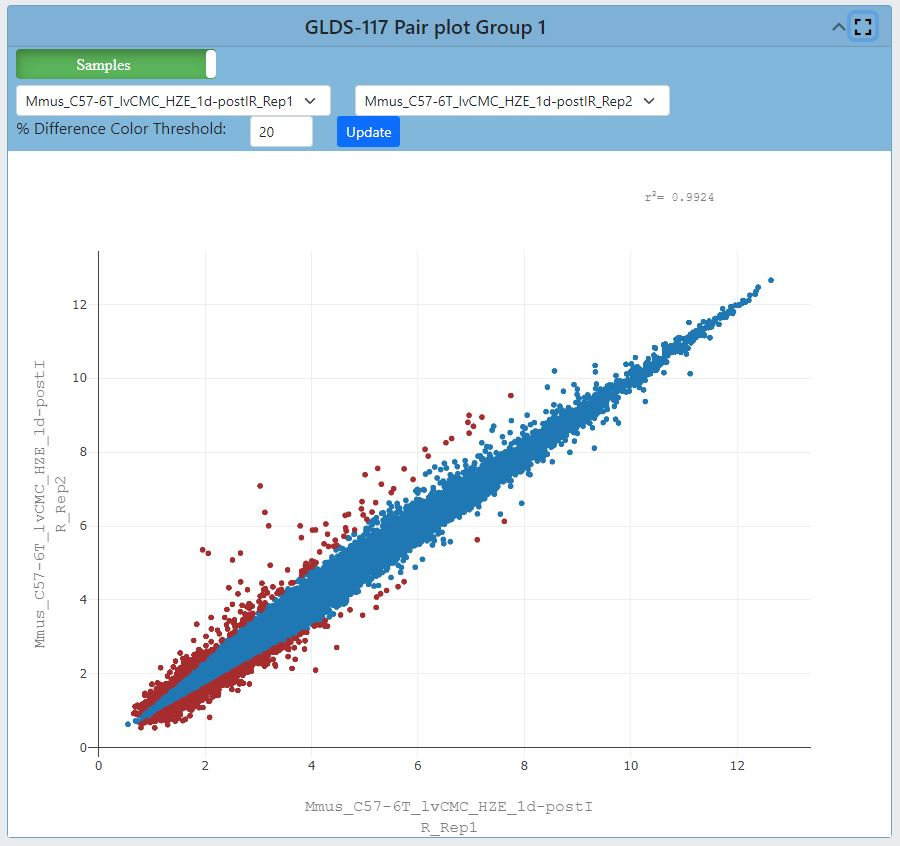
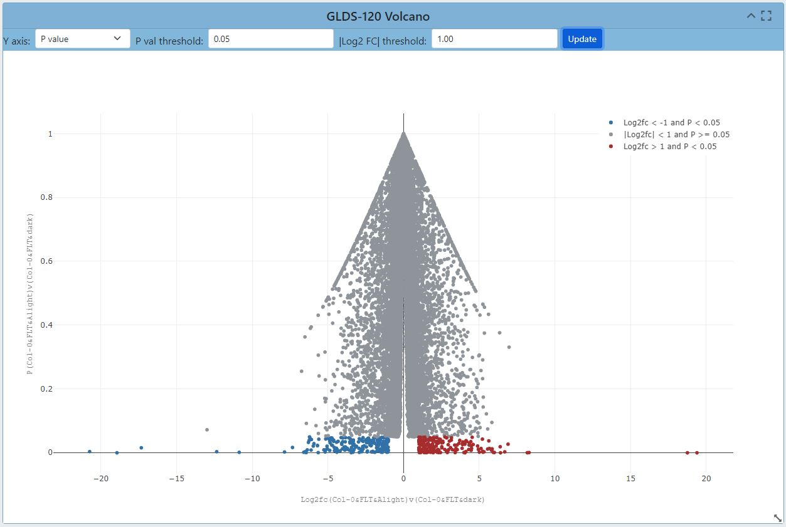
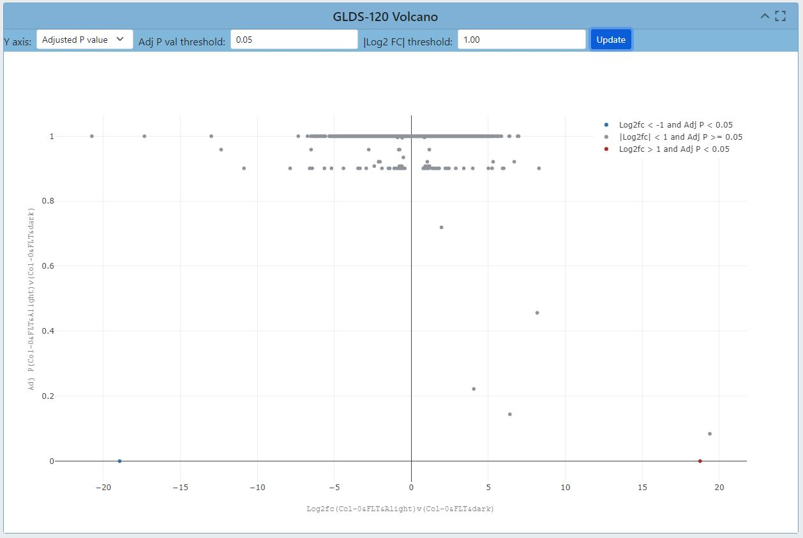
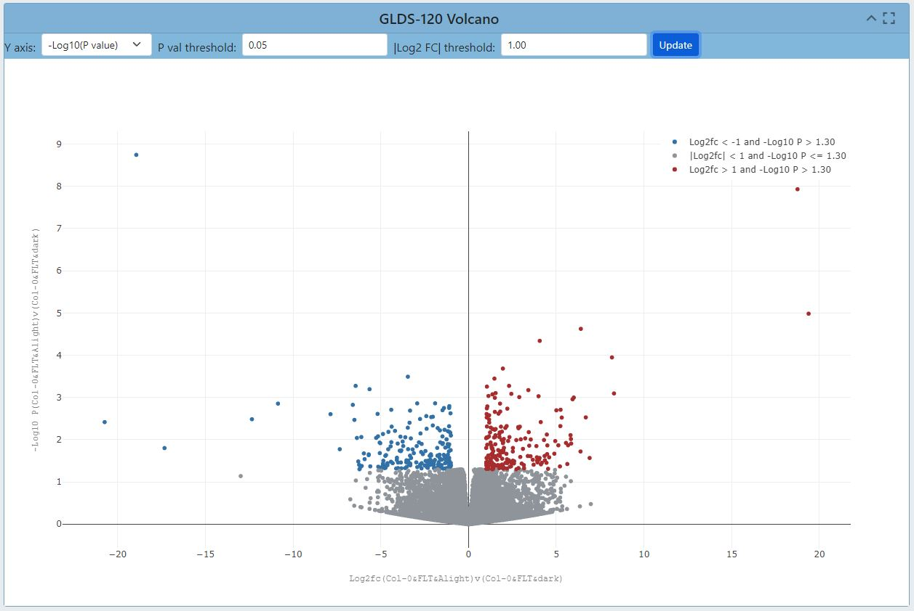

# Data Visualization Portal
## About GeneLab
GeneLab is an open-access resource that enables scientists to upload, store, share, and analyze omics data from spaceflight experiments. It facilitates information sharing, fosters innovation, and accelerates scientific discovery in space biology. By studying the effects of microgravity and space environment on DNA, RNA, proteins, and metabolites, GeneLab contributes to our understanding of biology, and advances in genomics. It provides coordinated data sets and metadata, allowing users to gain comprehensive insights and make novel discoveries. GeneLab's impact lies in its ability to facilitate information sharing, drive innovation, and ultimately expand our knowledge of how space conditions affect the fundamental building blocks of life.
## About Data Visualization
GeneLab has a Data Visualiation portal that provides users have the ability to interact with the processed data from space related studies within GeneLab's database. The portal encompasses various visualization types, including Gene Expression query tables, Dendrograms, Heatmaps, Ideogram, Gene Set Enrichment Analysis and a range of interactive plots including PCA plots, Pair plots, and Volcano plots. Each tool offers researchers flexibility to adjust parameters and explore specific aspects of the data effectively.

## Metadata Dashboard
The metadata dashboard is designed to help users narrow search results for experimental data. It provides various tools for filtering and displaying results.

### Pi Charts/# of Studies

Each section of the Pi chart acts as a filter, and when selected will automatically search for results containing that factor and display the results in the studies table below. A user can make one selection on each Pi chart to narrow results in the studies table.

*Picture*

### Filters on Left

In addition to the Pi Charts, there are specific filters on the left side of the dashboard that can be selected to narrow down results. When selecting filters on the Pi charts or on the left side of the dashboard, both sections will update to the selected filters.

*Picture*

Another tool provided with each individual Pi chart is the crosshairs on the bottom-left of the chart. When you select the crosshair a bar graph displaying the different factors listed within the Pi chart will appear. The bar graph is an additional way to display the number of results each factor has, and when a factor is selected from the bar graph that individual factor will be broken down further into the various types of the factor that was selected. The below example shows the breakdown of choosing Ionizing Radiation from the bar graph selection.

*Picture*

After selecting the desired filter from the bar graph, the user can press the apply filter button to update the results within the studies table.

### Studies Table

## Sidebar Functions

### Study Details button

### Plot links take you to plot location

### Modify Groups button

### Multi-study visualization has download DGE table button

## PCA Plots
### *What is it? Why is it useful?*
PCA stands for Principal Component Analysis, and this type of plot is used to reduce the dimensionality of large sets of data to simplify the process of analyzing the data points.

### *How do you use it?*
*2D vs 3D visualization* Each PCA plot will include options for a 2D and 3D representation of the data. The default selection is a 3D representation on an "X", "Y", and "Z" axis.

In the upper left corner of the plot area select the "2D" button and then press "Update"

The graph will update to display the data on an "X", and "Y" axis only.

*Color by Factor*

The "Color by Factor" feature allows users to select a specific factor from the study for representation on the graph to allow for an easier comparison between differences in the data.

Select the "Color by Facor" drop down menu

Within the drop down menu select one factor, then press the "Update" button

In this example, the "Cell Line" factor was selected from the drop down

The results will now be represented by colors matching the factor that was selected.

In this example (GLDS-154) the colors are representing the different cell lines from the experiment and clearly shows how the cell lines could be a factor in the differences between the data points.

*Click on factor labels to hide/unhide*

Another feature within the PCA plot tool allows users to hide factors by selecting the label located on the right side of the plot.

In this example (GLDS-154), the two labels provided are the cell lines "GM15036" which is represented by the color blue, and "GM15510" represented by the color orange.

Click on the label "GM15036" and the data points will be hidden as shown below

Click on the label "GM15036" a second time and the data will return.

*Upper right corner tools*

## Pair Plots
### *What is it? Why is it useful?*
Pair plots are used for Exploratoryt Data Analysis, where the plot visualizes the data in order to find a relationsip between variables that can be continuous or categorical. A Pair plot is used to understand the best set of features to explain a relationship between two variables or to form the most separated clusters. It also helps to form some simple classification models by drawing some simple lines or make linear separation in our data-set. (Reproducible, an ideal plot would have a correlation of 1) (2 groups because they only compare samples with same conditions)

### *How do you use it?*
The default display for the pair plot will be the comparison between two sets of data with a % difference color threshold of 20%. Two plots will be displayed on the dashboard for the ability to compare multiple sets of data simultaneously. 

Within the plot, users have the ability to change the % difference color threshold. Below is an example of the color threshold being altered to 37%.

Clicking each of the drop down menus will allow user to change which axis the sample data is displayed on.

Users also have the capability to view different data correlations by clicking the green "Samples" button at the top of the plot. Clicking this button will change the dropdown to show multiple correlation coefficients for a set of data. In the example below the data has three correlation coefficients that can be chosen.

## Volcano Plots
### *What is it? Why is it useful?*
A volcano plot is useful for identifying events that differ significantly between two groups of experimental subjects. The name volcano plot comes from its resemblance to a volcanic eruption with the most significant points at the top, like spewed pieces of molten lava. Each point on the graph represents a gene. The log2-fold differences between the groups are plotted on the x-axis and the -log10 p-value differences are plotted on the y-axis. The horizontal dashed line represents the significance threshold specified in the analysis, usually derived using a multiple testing correction.

The default display for Volcano Plots will have the -Log10(Adj P Value) with and Adj P Value threshold of 0.05 and a Log2 FC threshold of 1.00 as shown below.

Users have the ability to change the type of data displayed on the Y axis, and the options from the dropdown menu inculde "P Value, Adjusted P Value, and -Log10(P Value)". Below is an example of the "P value" display for a volcano plot.

The ability to change the P value threshold is available and the image below shows a P value threshold increase to 0.8. 

